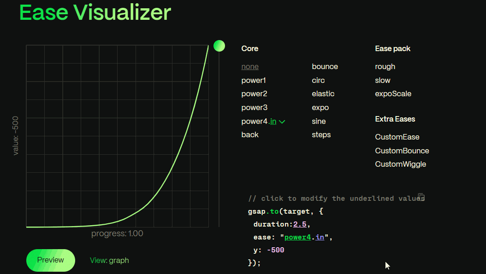
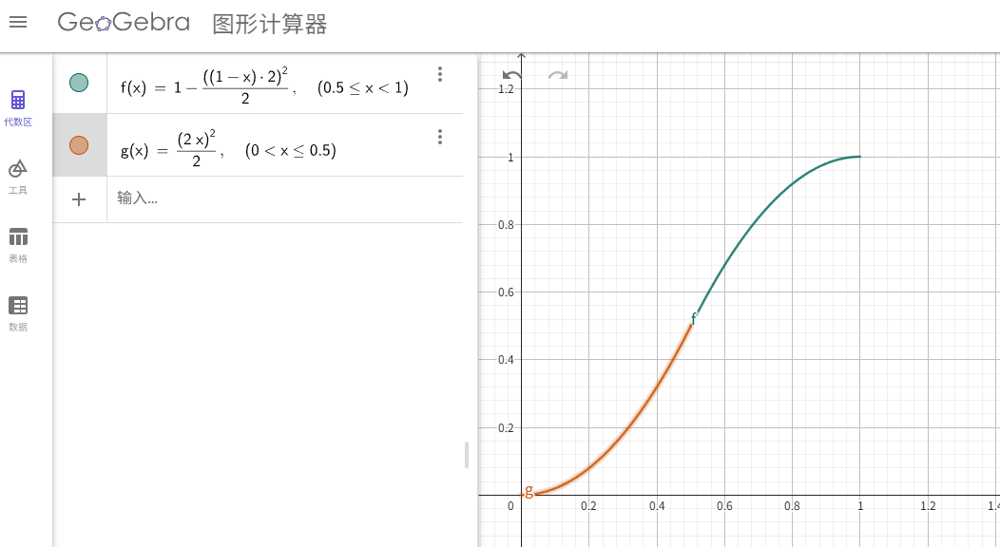

# 1、 轮盘抽奖实现原理

## 1.1 需求说明

实现一个轮盘抽奖滚动效果，整个滚动过程需要平滑滚动，滚动过程大概分为以下三步

- 1、启动轮盘滚动，从零开始加速运动
- 2、等待中奖结果返回、匀速滚动
- 3、中奖结果已经返回、减速滚动
<br>


## 1.2 动画实现流程

### 1.2.1 启动阶段 (onStart)

```javascript
function onStart() {
  // 模拟异步请求，5秒后返回结果
  setTimeout(() => {
    canStop = true;
    // 计算目标角度
    spinIndex = Math.floor(Math.random() * prizes.value.length);
    roundResultDeg = spinIndex * sectorAngle + sectorAngle / 2;
  }, 5000);

  // 开始滚动轮盘
  startRotate();
}
```

### 1.2.2 转动阶段 (startRotate)

使用 GSAP 时间轴分两个动画序列：

**第一段：加速启动**

```javascript
.to(wheelElement, {
  rotation: '+=90',
  duration: 0.3,
  ease: "power1.in",
})
```

- 快速旋转 90 度
- 使用`power1.in`缓动，模拟加速效果

**第二段：匀速循环**

```javascript
.to(wheelElement, {
  rotation: '+=360',
  duration: 1,
  ease: "none",
  repeat: -1,
  repeatDelay: 0,
  onRepeat() {
    rotateCounter++
  },
  onUpdate() {
    if (rotateCounter >= 1 && canStop) {
      onSpinEnd()
    }
  }
})
```

- 每秒转动 360 度（匀速）
- 无限循环（`repeat: -1`）
- 实时监测是否可以停止

### 1.2.3 减速停止阶段 (onSpinEnd)

```javascript
function onSpinEnd() {
  ...

  tl.kill()
  tl = gsap.timeline().to(wheelElement, {
    rotation: roundResultDeg + '_cw',
    duration,
    ease: "power1.out",
    onComplete() {
      isSpinning.value = false
    }
  })
}
```
<br>

## 1.3 问题分析


当前的轮盘动画实现存在**速度不连续**的问题，具体表现在两个关键衔接点：

#### 衔接点 1：加速阶段 → 匀速阶段

- **加速阶段**：90 度/0.3s，使用 `power1.in` 缓动
- **匀速阶段**：360 度/1s，使用 `none`（线性）  

#### 衔接点 2：匀速阶段 → 减速阶段

- **匀速阶段**：360 度/s 的恒定角速度
- **减速阶段**：使用 `power1.out` 从当前速度减速到 0  

#### 根本原因

- **缺乏速度连续性计算**：三段动画的参数（角度、时间、缓动函数）是独立设定的，没有考虑相邻段之间的速度衔接

#### 用户体验影响

- 轮盘转动过程中出现**微小的顿挫感**
- 视觉上可能产生**不自然的加速/减速突变**

#### 解决方案

要解决过渡平滑问题，必须先解决以下两个问题

- gsap 中的缓动函数名称对应的具体的函数，比如`power1.in`对应的函数是什么
- 基于缓动函数计算衔接点处的两个函数的导数，导数代表的变化率，也就是速度
<br>
<br>  


# 2、 GSAP缓动函数研究

## 2.1 分段函数求导

分析 gsap 源码可知  

`power1.in`对应的函数为 

$f(p) = p^2$

函数求导为：

$f'(p) = 2p$

该运动函数在进度 1 处的导数为 $f'(1) = 2$， 即 $v_1 = 2$
<br>
<br>
`none`对应的函数为 

$f(p) = p$

函数求导为：

$f'(p) = 1$

该运动函数在进度 0 处的导数为 $f'(0) = 1$，在进度 1 处的导数为 $f'(1) = 1$，即 $v_0 = 1$, $v_1 = 1$
<br>
<br>
`power1.out`对应函数为 

$f(p) = 1 - (1-p)^2$

函数求导为:

$f(p) = 1 - (1-p)^2 = 2p - p^2$

$f'(p) = 2 - 2p$

该运动函数在进度 0 处的导数为 $f'(0) = 2$，即 $v_0 = 2$

<br>

## 2.2 程序中的参数计算

第一段动画为基准，计算第二段匀速动画应该设置的时间
第一段

```
  rotation: '+=90',
  duration: 0.3,
  ease: "power1.in",
```

第二段

```
  rotation: '+=360',
  duration: 1, // 待计算调整
  ease: "none",
```

很容计算出第二段匀速动画设置的时间

```
t = 360 / (90 / 0.3) / 2 = 0.6
```

所以参数需调整为

```
  rotation: '+=360',
  duration: 0.6,
  ease: "none",
```

假设第三段动画需要额外转动的角度为 diff（该值需要基于中奖结果对应的角度和当前的角度进行差值运算）  
计算第三算减速动画设置的时间

```
t = diff / (360 / 0.6) * 2
```

参数优化后效果如下  

<br>
<br>

## 2.3 N阶缓入函数和N阶缓出函数导数计算

gsap 各类缓动函数的源码部分现已提取`src/gsap-ease-functional.ts`文件中。根据源码可知  

**n (n > 1) 阶缓入函数：** 

$f(p) = p^n$

$f'(p) = np^{n-1}$

$f'(0) = 0, \quad f'(1) = n$

即 n 阶缓入函数在起始阶段的速度为 0，在结束阶段的速度为 n

<br>

**n (n > 1) 阶缓出函数：** 

$f(p) = 1 - (1-p)^n$

设 $v = 1 - p$，则 $f(p) = 1 - v^n$, 且 $\frac{dv}{dp} = -1$。

$f'(p) = 1 - nv^{n-1} \cdot \frac{dv}{dp}$

$= 1 - n(1-p)^{n-1} \cdot (-1)$

$= n(1-p)^{n-1}$

$f'(0) = n, \quad f'(1) = 0$

即 n 阶缓出函数在起始阶段的速度为 n，在结束阶段的速度为 0

**总结**：   
Power[n].in 在起始阶段速度为0， 在结束阶段速度为n  
Power[n].out 在起始阶段速度为n, 在结束阶段速度为0



[gsap动画预览工具链接地址](https://gsap.com/docs/v3/Eases)
<br>
<br>

## 2.4 扩展与延申

我们不仅有缓入函数和缓出函数，也存在这种先缓入再缓出的组合函数  
比如**Power2.inOut**，通过分析源码可知其对应函数为**两段分段函数组合**而成，函数方程式和函数曲线如下



[函数图形绘制工具](https://www.geogebra.org/graphing)

这种分段函数肯定也必须满足在衔接点的进度值和速度相同，也就是连续可导，否则这种组合函数也无法平滑过渡  
进度值直接带入 $x = 0.5$，$f(x) = g(x) = 0.5$，即此处进度值相等

我们需要证明以下分段函数在 $p = 0.5$ 处的导数在两个区间相等。函数定义如下，参数 $p$ 的范围为 $[0, 1]$：

当 $p < 0.5$ 时：

$f(p) = \frac{(2p)^{\text{power}}}{2}$

当 $p \geq 0.5$ 时：

$f(p) = 1 - \frac{(2(1 - p))^{\text{power}}}{2}$

这里 $\text{power}$ 为任意实数，我们的目标是计算 $p = 0.5$ 处的左导数和右导数，并验证它们是否相等。

**计算导数**

**(1) 对于 $p < 0.5$ 的部分**

函数为：

$f(p) = \frac{(2p)^{\text{power}}}{2}$

- 设 $u = 2p$，则 $f(p) = \frac{1}{2} u^{\text{power}}$，且 $\frac{du}{dp} = 2$。
- 对 $p$ 求导：

$f'(p) = \frac{1}{2} \cdot \text{power} \cdot u^{\text{power} - 1} \cdot \frac{du}{dp}$

$= \frac{1}{2} \cdot \text{power} \cdot (2p)^{\text{power} - 1} \cdot 2$

$= \text{power} \cdot (2p)^{\text{power} - 1}$

$= \text{power} \cdot 2^{\text{power} - 1} \cdot p^{\text{power} - 1}$

于是，当 $p < 0.5$ 时，导数为：

$f'(p) = \text{power} \cdot 2^{\text{power} - 1} \cdot p^{\text{power} - 1}$

**(2) 对于 $p \geq 0.5$ 的部分**

函数为：

$f(p) = 1 - \frac{(2(1 - p))^{\text{power}}}{2}$

- 设 $v = 2(1 - p)$，则 $f(p) = 1 - \frac{1}{2} v^{\text{power}}$，且 $\frac{dv}{dp} = -2$。
- 对 $p$ 求导：

$f'(p) = 0 - \frac{1}{2} \cdot \text{power} \cdot v^{\text{power} - 1} \cdot \frac{dv}{dp}$

$= -\frac{1}{2} \cdot \text{power} \cdot (2(1 - p))^{\text{power} - 1} \cdot (-2)$

$= \text{power} \cdot (2(1 - p))^{\text{power} - 1}$

$= \text{power} \cdot 2^{\text{power} - 1} \cdot (1 - p)^{\text{power} - 1}$

于是，当 $p \geq 0.5$ 时，导数为：

$f'(p) = \text{power} \cdot 2^{\text{power} - 1} \cdot (1 - p)^{\text{power} - 1}$

通过以上计算，我们证明了对于任意 $\text{power}$，该分段函数在 $p = 0.5$ 处的左导数和右导数都等于 $\text{power}$，因此它们相等。这意味着函数在 $p = 0.5$ 处是可导的，且导数在该点连续。